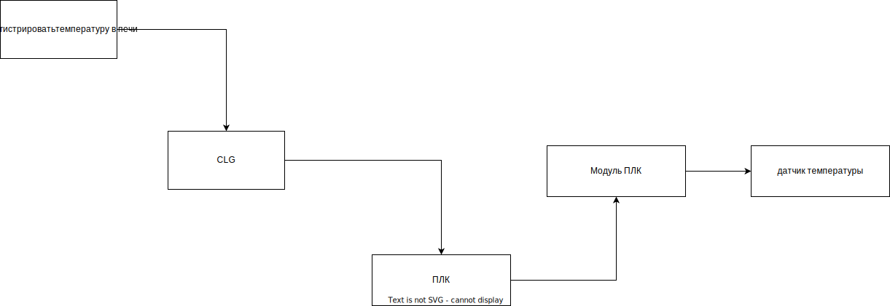

# Содержание

1. Концепция
   1. Данные как технологические параметры
   2. Тех параметры не зависят от способа их оцифровки
   3. Конфигурация и логика
2. Как сделано в CLG
   1. DeviceExchangeManager
   2. Listener и очереди перемещений
   3. Listener и тех параметры
   4. Проблемы масштабируемости
3. Принцип работы
   1. Создание класса с логикой
   2. Создание конфигурации
   3. Построение
   4. Комплексные типы
4. Примеры работы
   1. Пример с созданием простой точки
   2. Пример с созданием сложной точки
   3. Пример с методами
5. Перспективы развития
   1. Поддержка массивов
   2. Поддержка обобщений

 # Концепция

## Данные как технологические параметры

1. Данные, которые может предоставить нижний уровень - это обычно данные предметной области.

## Тех параметры не зависят от способа их оцифровки

Температура в печи остаётся температурой в печи, не зависимо от того,
какой ПЛК оцифровал эту температуру и передал в информационную систему.

Более того, может потребоваться дополнительные датчики, которые будут 
подключены уже к другим устройствам.

## Конфигурация и логика
 
1. Логика получения данных - протокол обмена
2. Протоколы обмена кодируются
3. Есть набор протоколов, его можно дополнять
4. Выбор протокола и его настройка - конфигурация
5. Конфигурация не кодируется
6. Логика над данными - архивирование, передача в шину, вывод на АРМ и другое - кодируется
7. Набор классов работы над данными легко дополнять
8. Выбор классов для работы над данными - конфигурация
9. Конфигурирование протокола получения данных и логики обработки данных - связанная конфигурация

Даже если сейчас основной протокол обмена это OPC UA, то мы можем использовать весь его функционал.
Но в случае, если потребуется собирать/отдавать данные по другому протоколу, для этого будет 
заложена возможность

Сейчас существует большое количество различных протоколов, 
которые постоянно используются в промышленности

Канал связи, по которому информационная система получить температуры, может
менятся от проекта к проекту, от ПЛК к ПЛК. Но его функция останется неизменной.

Данные, которые получает АТИССа от ПЛК, это данные предметной области.
Способ их получения, каналы связи, протоколы и т.д. - это не относится к предметной области.

Во-первых, я предлагаю разделить эти вещи на уровне кода. Там где мы пишем логику 
над данными предметной области не должно быть логики получения этих данных.

Во-вторых, логика получения этих данных может быть незименна, изменению подвержена конфигурация.
Конфигурация не должна быть закодирована

# Как сделано в CLG

## DeviceExchangeManager

1. Класс создает экземпляры Listener для заданных хостов
2. Логика Listener незименна, неконфигурируема

## Listener и очередь перемещений

1. Класс обращается через client к заданным нодам
2. Класс зависим от протокола OpcUa
3. Объекты класса не могут быть законфигурированы
4. чтение тех параметров в Listener по причине того, что в нём уже реализован доступ к ПЛК

## Проблемы масштабируемости 

1. Объект Listener создается  на каждый ПЛК, без возможности изменения поведения
2. Чтобы добавить новые тех параметры, нужно расширать класс Listener

# Принцип работы

## Создание класса с логикой

1. Данные представлены в примитивных типах
2. Кроме данных, могут потребоваться метаданные
3. Внедрение зависимости через 
4. Точки DpValue
5. Точки DpAction
6. IWorker

## Создание конфигурации

1. Конфигурация - связать данные с логикой
2. Конфигурация не зависит от способа хранения
3. Конфигурация должна быть читаемой и редактируемой

## Построение

1. Класс XmlBuilder
2. Создание соединений
3. Создание Worker
4. Создание DpValue
5. Создание DpAction

## Комлпексные типы

1. Как сделать соответствие в комплексном типе
2. Как сделать соответствие в аргументах метода

# Перспективы развития

## Поддержка массивов
1. Массивы как 

## Поддержка обобщений

