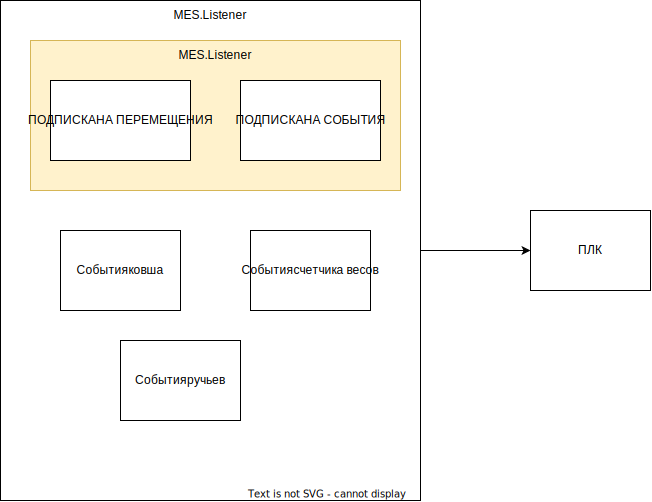

[Назад](readme.md)

## DeviceExchangeManager

1. Класс создает экземпляры Listener для заданных хостов
2. Логика Listener незименна, неконфигурируема

## Listener и очередь перемещений

1. Класс обращается через client к заданным нодам
2. Класс зависим от протокола OpcUa
3. Объекты класса не могут быть законфигурированы
4. чтение тех параметров в Listener по причине того, что в нём уже реализован доступ к ПЛК

Если в проекте появляется необходимость дополнительных коммуникаций, нужно расширять Listener.
На каждый ПЛК по прежнему создаются однотипные Listener

## Проблемы масштабируемости 

1. Объект Listener создается  на каждый ПЛК, без возможности изменения поведения
2. Чтобы добавить новые тех параметры, нужно расширать класс Listener

[Принцип работы](принцип.md)

