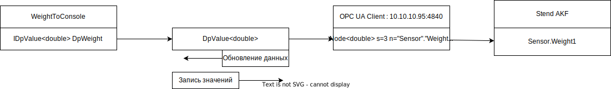

[Назад](readme.md)

## Создание класса с логикой


```c#
class WeightToConsole
{
    public IDpValue<double> DpWeight {get; set; }
}
```
Что такое IDpValue?

```c#
interface IDpValue<T>
{
    T Value {get; set;}; //Значение из ПЛК или другого устройства
    event EventHandler<T> ValueUpdated; //Событие, что новое значение считано

    ?? Status; //Метаданные о состоянии соединения.

}
```

Всё остальное - конфигурация

```xml
<DpConfiguration>

	<Connections>
		<Connection TypeName="DpConnect.OpcUa.IOpcUaConnection, DpConnect.OpcUa" 
                    ConnectionId ="Stend AKF">
			<Endpoint>opc.tcp://10.10.10.95:4840</Endpoint>
		</Connection>		
	</Connections>

	<Workers>
		<Worker TypeName="DpConnect.TempRead.DpConnect.WeightToConsole, DpConnect.WeightRead">
			
			
			<DpValue PropertyName="DpWeight">
				<SourceConfiguration ConnectionId ="Stend AKF">
					<NodeId>ns=3;s="Sensor"."Weight1"</NodeId>
				</SourceConfiguration>
			</DpValue>

		</Worker>	
						
	</Workers>
	
</DpConfiguration>	
```


## Создание конфигурации

1. Конфигурация - связать данные с логикой


2. Конфигурация не зависит от способа хранения - может быть в xml, или другом формате


3. Конфигурация должна быть читаемой и редактируемой

Основа конфигурации - связать свойства класса (по их имени) с данными, полученными по некоторому протоколу.


## Построение


## Что получаем в итоге



## Комлпексные типы

1. Как сделать соответствие в комплексном типе
2. Как сделать соответствие в аргументах метода


[Пример с Tundish](пример%20tundish.md)